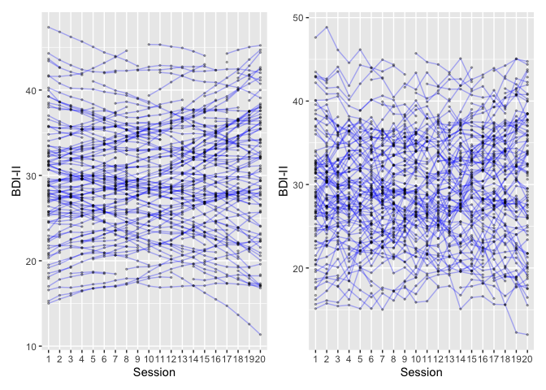
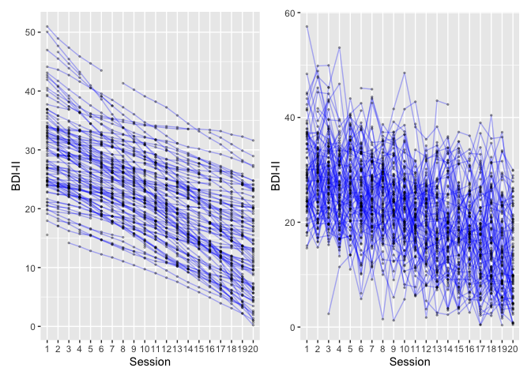
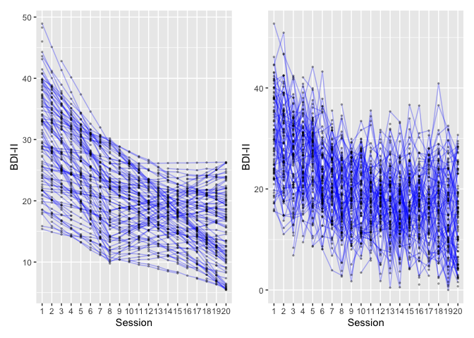

<!-- README.md is generated from README.Rmd. Please edit that file -->

# suddengains-simulation

## Overview

The function `sim_tx()` simulates longitudinal data.

The following parameters are available to define the trajectories:

-   `n`: Numeric, specifying the sample size
-   `tp`: Numeric, specifying the number of repeated measurements
-   `mean_b0`: Numeric, specifying the mean at the first time point
-   `sd_b0`: Numeric, specifying the standard deviation at the first
    time point
-   `low_b0`: Numeric, specifying the lower limit at the first time
    point
-   `up_b0`: Numeric, specifying the upper limit at the first time point
-   `mean_yf`: Numeric, specifying the mean at the last time point
-   `sd_yf`: Numeric, specifying the standard deviation at the last time
    point
-   `mu`: Numeric, specifying the mean autocorrelation
-   `s`: Numeric, specifying the standard deviation of autocorrelations
-   `mu_j`: Numeric, specifying the mean of the jiggle
-   `s_j`: Numeric, specifying the standard deviation of the jiggle
-   `tm`: Numeric, specifying the time point separating the first and
    second piece of the change
-   `mean_ym`: Numeric, specifying the mean at time point “tm”
-   `sd_ym`: Numeric, specifying the standard deviation at time point
    “tm”
-   `jiggle`: Logical, specifying whether to add jiggle (TRUE) or not
    (FALSE)

Additional arguments:

-   `na_pct`: Numeric, specifying percentage of missing data from 0 (no
    missing data) to 1 (all values are missing).
-   `sim_method`: String, specifying the underlying trajectories for
    simulating data
-   `return`: String, specifying whether to return a “long” (one row per
    time point per ID) or “wide” data set

``` r
# Load packages ----
library(tidyverse)
library(patchwork)
library(here)

# Load simulation function ----
source(here("app/tx_sim_fun.R"))
```

# Simulate data

## No change

``` r
# No change
# No jiggle
# Simulate data for n = 100 individuals with 20 repeated measures
df_no_01_long_jf <- sim_tx(n = 100, tp = 20, 
                           mean_b0 = 29.33, sd_b0 = 8.04, 
                           low_b0 = 15, up_b0 = 63, 
                           mean_yf = 15.9, sd_yf = 11.9, 
                           mu = 0, s = 0.2, 
                           mu_j = 0, s_j = 1, 
                           tm = 8, mean_ym = 20, sd_ym = 7, 
                           sim_method = "nochange",
                           jiggle = FALSE, 
                           seed = 1213,  
                           na_pct = .1,
                           return = "long")

# Create plot
plot_no_01_long_jf <- df_no_01_long_jf %>%
  ggplot(aes(x = factor(time), y = value, group = id)) +
  geom_line(alpha = .3, colour = "blue") +
  geom_point(alpha = .3, size = .5) +
  labs(x = "Session", y = "BDI-II")

# No change
# With jiggle
# Simulate data for n = 100 individuals with 20 repeated measures
df_no_01_long_jt <- sim_tx(n = 100, tp = 20, 
                           mean_b0 = 29.33, sd_b0 = 8.04, 
                           low_b0 = 15, up_b0 = 63, 
                           mean_yf = 15.9, sd_yf = 11.9, 
                           mu = 0, s = 0.2, 
                           mu_j = 0, s_j = 1, 
                           tm = 8, mean_ym = 20, sd_ym = 7, 
                           sim_method = "nochange",
                           jiggle = TRUE, 
                           seed = 1213,  
                           na_pct = .1,
                           return = "long")

# Create plot
plot_no_01_long_jt <- df_no_01_long_jt %>%
  ggplot(aes(x = factor(time), y = value, group = id)) +
  geom_line(alpha = .3, colour = "blue") +
  geom_point(alpha = .3, size = .5) +
  labs(x = "Session", y = "BDI-II")

# Plot data
plot_no_01_long_jf + plot_no_01_long_jt
```

<!-- -->

## Linear change

``` r
# Linear change
# No jiggle
# Simulate data for n = 100 individuals with 20 repeated measures
df_lin_01_long_jf <- sim_tx(n = 100, tp = 20, 
                            mean_b0 = 29.33, sd_b0 = 8.04, 
                            low_b0 = 15, up_b0 = 63, 
                            mean_yf = 15.9, sd_yf = 11.9, 
                            mu = 0, s = 0.2, 
                            mu_j = 0, s_j = 5, 
                            tm = 8, mean_ym = 20, sd_ym = 7, 
                            sim_method = "linear",
                            jiggle = FALSE, 
                            seed = 123,  
                            na_pct = .1,
                            return = "long")

# Create plot
plot_lin_01_long_jf <- df_lin_01_long_jf %>%
  ggplot(aes(x = factor(time), y = value, group = id)) +
  geom_line(alpha = .3, colour = "blue") +
  geom_point(alpha = .3, size = .5) +
  labs(x = "Session", y = "BDI-II")


# Linear change
# With jiggle
# Simulate data for n = 100 individuals with 20 repeated measures
df_lin_01_long_jt <- sim_tx(n = 100, tp = 20, 
                        mean_b0 = 29.33, sd_b0 = 8.04, 
                        low_b0 = 15, up_b0 = 63, 
                        mean_yf = 15.9, sd_yf = 11.9, 
                        mu = 0, s = 0.2, 
                        mu_j = 0, s_j = 5, 
                        tm = 8, mean_ym = 20, sd_ym = 7, 
                        sim_method = "linear",
                        jiggle = TRUE, 
                        seed = 123,  
                        na_pct = .1,
                        return = "long")

# Create plot
plot_lin_01_long_jt <- df_lin_01_long_jt %>%
  ggplot(aes(x = factor(time), y = value, group = id)) +
  geom_line(alpha = .3, colour = "blue") +
  geom_point(alpha = .3, size = .5) +
  labs(x = "Session", y = "BDI-II")

# Plot data
plot_lin_01_long_jf + plot_lin_01_long_jt
```

<!-- -->

## Loglinear change

``` r
df_log_01_long_jf <- sim_tx(n = 100, tp = 20, 
                            mean_b0 = 29.33, sd_b0 = 8.04, 
                            low_b0 = 15, up_b0 = 63, 
                            mean_yf = 15.9, sd_yf = 11.9, 
                            mu = 0, s = 0.2, 
                            mu_j = 0, s_j = 1, 
                            tm = 8, mean_ym = 20, sd_ym = 7, 
                            sim_method = "pseudolog",
                            jiggle = FALSE, 
                            seed = 1213,  
                            na_pct = .1,
                            return = "long")

plot_log_01_long_jf <- df_log_01_long_jf %>%
  ggplot(aes(x = factor(time), y = value, group = id)) +
  geom_line(alpha = .3, colour = "blue") +
  geom_point(alpha = .3, size = .5) +
  labs(x = "Session", y = "BDI-II")


df_log_01_long_jt <- sim_tx(n = 100, tp = 20, 
                            mean_b0 = 29.33, sd_b0 = 8.04, 
                            low_b0 = 15, up_b0 = 63, 
                            mean_yf = 15.9, sd_yf = 11.9, 
                            mu = 0, s = 0.2, 
                            mu_j = 0, s_j = 5, 
                            tm = 8, mean_ym = 20, sd_ym = 7, 
                            sim_method = "pseudolog",
                            jiggle = TRUE, 
                            seed = 1213,  
                            na_pct = .1,
                            return = "long")

plot_log_01_long_jt <- df_log_01_long_jt %>%
  ggplot(aes(x = factor(time), y = value, group = id)) +
  geom_line(alpha = .3, colour = "blue") +
  geom_point(alpha = .3, size = .5) +
  labs(x = "Session", y = "BDI-II")


plot_log_01_long_jf + plot_log_01_long_jt
```

<!-- -->

# Identify sudden gains

``` r
# Transform all datasets into wide format (one row per individual, one variable per column)
# Add information about simulation
df_no_01_wide_jf <- df_no_01_long_jf %>% 
  pivot_wider(id_cols = id, 
              names_from = time, 
              values_from = value, 
              names_prefix = "bdi_t") %>% 
  mutate(source = "df_no_01_long_jf")

df_no_01_wide_jt <- df_no_01_long_jt %>% 
    pivot_wider(id_cols = id, 
              names_from = time, 
              values_from = value, 
              names_prefix = "bdi_t") %>% 
  mutate(source = "df_no_01_long_jt")


df_lin_01_wide_jf <- df_lin_01_long_jf %>% 
    pivot_wider(id_cols = id, 
              names_from = time, 
              values_from = value, 
              names_prefix = "bdi_t") %>% 
  mutate(source = "df_lin_01_long_jf")

df_lin_01_wide_jt <- df_lin_01_long_jt %>% 
    pivot_wider(id_cols = id, 
              names_from = time, 
              values_from = value, 
              names_prefix = "bdi_t") %>% 
  mutate(source = "df_lin_01_long_jt")


df_log_01_wide_jf <- df_log_01_long_jf %>% 
    pivot_wider(id_cols = id, 
              names_from = time, 
              values_from = value, 
              names_prefix = "bdi_t") %>% 
  mutate(source = "df_log_01_long_jf")

df_log_01_wide_jt <- df_log_01_long_jt %>% 
    pivot_wider(id_cols = id, 
              names_from = time, 
              values_from = value, 
              names_prefix = "bdi_t") %>% 
  mutate(source = "df_log_01_long_jt")


aaa <- df_no_01_wide_jf %>% 
  dplyr::add_row(df_no_01_wide_jt) %>% 
  dplyr::add_row(df_lin_01_wide_jf) %>% 
  dplyr::add_row(df_lin_01_wide_jt) %>% 
  dplyr::add_row(df_log_01_wide_jf) %>% 
  dplyr::add_row(df_log_01_wide_jt) %>% 
  dplyr::group_split(source)

bbb <- map(aaa, possibly(suddengains::create_byperson, NA), 
              sg_crit1_cutoff = 7, 
              id_var_name = "id", 
              sg_measure_name = "bdi",
              sg_var_list = paste0("bdi_t", 1:20), 
              tx_start_var_name = "bdi_t1", 
              tx_end_var_name = "bdi_t20")
#> First, second, and third sudden gains criteria were applied.
#> The critical value for the third criterion was adjusted for missingness.
#> First, second, and third sudden gains criteria were applied.
#> The critical value for the third criterion was adjusted for missingness.
#> The first gain/loss was selected in case of multiple gains/losses.
#> First, second, and third sudden gains criteria were applied.
#> The critical value for the third criterion was adjusted for missingness.
#> First, second, and third sudden gains criteria were applied.
#> The critical value for the third criterion was adjusted for missingness.
#> The first gain/loss was selected in case of multiple gains/losses.
#> First, second, and third sudden gains criteria were applied.
#> The critical value for the third criterion was adjusted for missingness.
#> First, second, and third sudden gains criteria were applied.
#> The critical value for the third criterion was adjusted for missingness.


df_log_01_wide_jt %>% 
  suddengains::create_bysg(sg_crit1_cutoff = 2, 
                               id_var_name = "id", 
                               sg_var_list = paste0("bdi_t", 1:20), 
                               sg_measure_name = "bdi",
                               tx_start_var_name = "bdi_t1", 
                               tx_end_var_name = "bdi_t20")
#> First, second, and third sudden gains criteria were applied.
#> The critical value for the third criterion was adjusted for missingness.
#> # A tibble: 46 x 36
#>       id id_sg    sg_crit123 sg_session_n sg_freq_byperson bdi_t1 bdi_t2 bdi_t3
#>    <dbl> <chr>         <int>        <dbl>            <int>  <dbl>  <dbl>  <dbl>
#>  1     3 3_sg_11           1           11                1   23.5   33.2   25.9
#>  2     7 7_sg_15           1           15                1   27.4   NA     28.0
#>  3     8 8_sg_9            1            9                2   41.7   34.4   37.0
#>  4     8 8_sg_16           1           16                2   41.7   34.4   37.0
#>  5    13 13_sg_11          1           11                1   31.0   20.2   20.9
#>  6    14 14_sg_16          1           16                1   42.4   40.8   NA  
#>  7    16 16_sg_5           1            5                1   22.0   20.2   20.2
#>  8    17 17_sg_10          1           10                1   21.8   22.9   38.1
#>  9    18 18_sg_17          1           17                1   30.5   24.6   28.2
#> 10    19 19_sg_3           1            3                1   34.2   34.9   26.5
#> # … with 36 more rows, and 28 more variables: bdi_t4 <dbl>, bdi_t5 <dbl>,
#> #   bdi_t6 <dbl>, bdi_t7 <dbl>, bdi_t8 <dbl>, bdi_t9 <dbl>, bdi_t10 <dbl>,
#> #   bdi_t11 <dbl>, bdi_t12 <dbl>, bdi_t13 <dbl>, bdi_t14 <dbl>, bdi_t15 <dbl>,
#> #   bdi_t16 <dbl>, bdi_t17 <dbl>, bdi_t18 <dbl>, bdi_t19 <dbl>, bdi_t20 <dbl>,
#> #   sg_bdi_2n <dbl>, sg_bdi_1n <dbl>, sg_bdi_n <dbl>, sg_bdi_n1 <dbl>,
#> #   sg_bdi_n2 <dbl>, sg_bdi_n3 <dbl>, sg_magnitude <dbl>,
#> #   sg_bdi_tx_change <dbl>, sg_change_proportion <dbl>,
#> #   sg_reversal_value <dbl>, sg_reversal <dbl>
```
